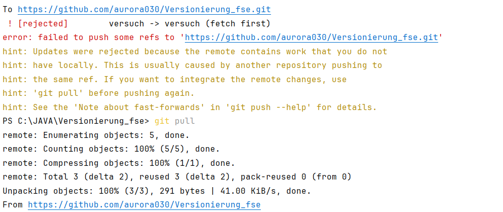
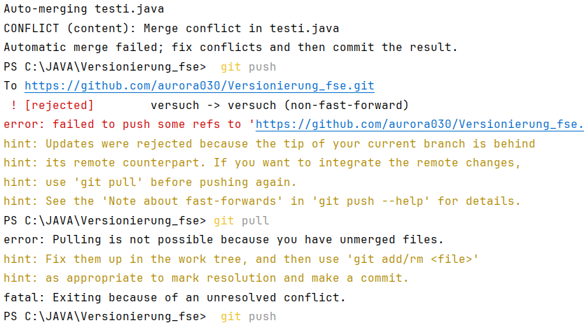
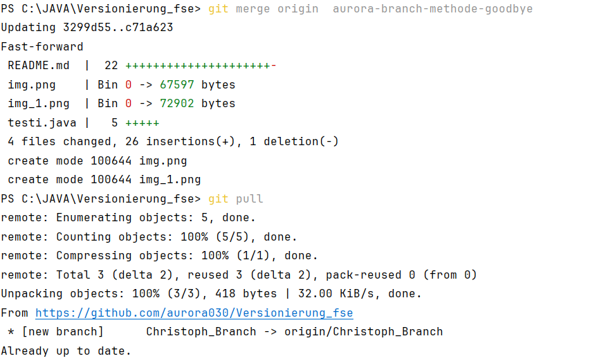

# Das ist mein erstes Versuch etwas zu ändern auf einem Branch 

# git

# Rebase vs Merge

Beides führt zum gleichen Ergebnis, aber wenn ich merge verwende, 
bleiben meine Commits in der ursprünglichen Reihenfolge und es wird 
ein verzweigter Verlauf erzeugt. Beim rebase werden meine Commits auf 
die Spitze des Ziel-Branches gesetzt, was einen linearen Verlauf erzeugt.

- Rebase: wenn ich nicht alleine arbeite und die History passt aber nicht mehr zusammen also die Linie rebase nur dann wenn ich allein lokal arbeite
+ Rebase: kann man alle historien sehen

fast forward: ? 

## Merge konflikt:

##  GitHub-Flow-Vorgangsweise

GitHub Flow ist ein moderner Git-Workflow, der Teams hilft, schnell und kontinuierlich Änderungen zu entwickeln, zu testen und bereitzustellen. Durch die Nutzung von Branches und Pull Requests wird die Zusammenarbeit gefördert und die Qualität 
des Codes sichergestellt, während gleichzeitig eine einfache und schnelle Entwicklung ermöglicht wird.

Dabei habe ich eine goodbye methode gemacht in meinem Branch und diese auch ohne probleme gemerged

A---B---C----D-----------E  master
\   \  /           /
\   ta1  topicA  /
\              /
tb1---tb2---tb3  topicB

## Branching-Strategien

# Vergleich von Branching-Management-Strategien mit Git

| **Strategie**            | **Zentrale Charakteristika**                                                                                                                                             | **Vorteile**                                                                                                                                              | **Nachteile**                                                                                                                     |
|---------------------------|--------------------------------------------------------------------------------------------------------------------------------------------------------------------------|-----------------------------------------------------------------------------------------------------------------------------------------------------------|-----------------------------------------------------------------------------------------------------------------------------------|
| **GitHub Flow**           | - Hauptfokus auf einem einzigen `main` Branch - Feature Branches werden für Änderungen erstellt und nach Pull-Request-Merge integriert                                | - Einfach und leicht zu lernen - Gut für kontinuierliche Integration und Deployment - Schnellere Iterationen                                         | - Nicht geeignet für komplexe Projekte - Keine Unterstützung für Releases oder Hotfixes auf ältere Versionen                  |
| **Git Flow**              | - Nutzt mehrere permanente Branches (`main`, `develop`, `release`, `hotfix`) - Feature Branches werden von `develop` abgeleitet und integriert                        | - Gut für große Projekte mit klaren Release-Zyklen - Bessere Kontrolle über Release- und Hotfix-Management                                             | - Komplexer Workflow - Kann langsamer bei Deployment-Prozessen sein                                                           |
| **Trunk-Based Development** | - Alle Entwickler arbeiten direkt am `trunk` (Hauptbranch) - Änderungen werden durch Feature Flags oder kleine iterative Updates in den Code integriert             | - Ideal für Continuous Delivery - Minimale Branch-Verwaltung - Erleichtert die Zusammenarbeit durch weniger Merge-Konflikte                          | - Risiko von Instabilitäten im Hauptbranch - Erfordert diszipliniertes Testen und Feature Flags                               |

## Zusammenfassung:

- **GitHub Flow**: Beste Wahl für kleinere oder kontinuierlich bereitgestellte Projekte, die schnell und unkompliziert iterieren möchten.
- **Git Flow**: Geeignet für größere, strukturierte Projekte mit klaren Release-Zyklen, erfordert jedoch mehr organisatorischen Aufwand.
- **Trunk-Based Development**: Unterstützt agile, schnelle Entwicklungszyklen und kontinuierliche Bereitstellung, benötigt jedoch eine disziplinierte Umsetzung.

